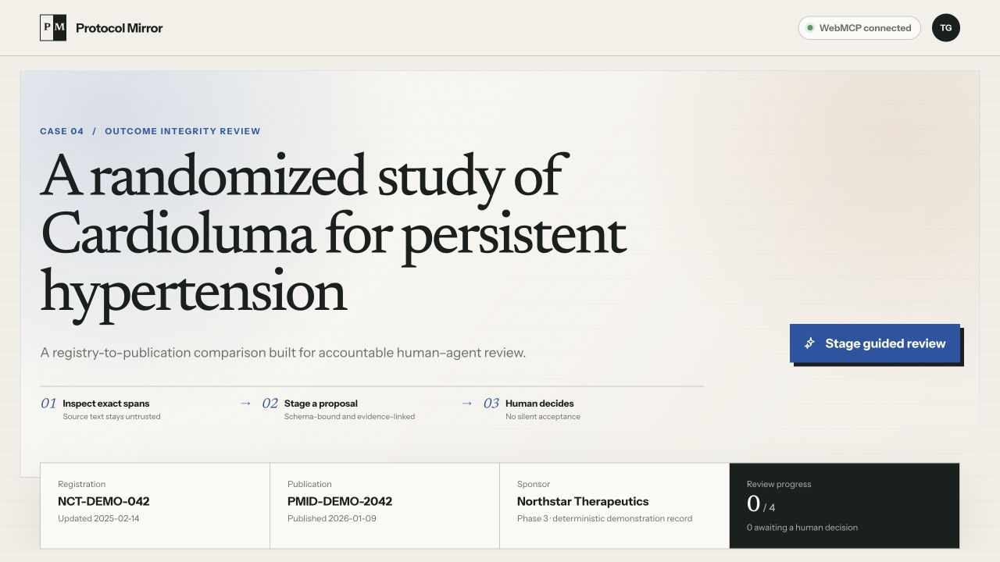

# Protocol Mirror

**Did the trial publish what it registered? Your agent pulls ClinicalTrials.gov and PubMed, quotes exact spans. You decide.**

**Live app:** https://protocol-mirror.vercel.app · **Source (MIT):** https://github.com/TanavG223/protocol-mirror

Research transparency aid only. Not medical advice, a clinical decision system, or a finding of research misconduct.



## Five-minute walkthrough

No account, API key, flag, or setup. Open https://protocol-mirror.vercel.app in Chrome 149 or newer: the live origin serves a Chrome WebMCP origin-trial token, verified on 2026-09-02 in Chrome 152 with no flag. (A local build is a different origin and still needs `chrome://flags/#enable-webmcp-testing`.) The ChatGPT/Codex in-app browser with site tools enabled works too. Paste the prompts into whichever agent is driving the browser: the client verified end to end is the ChatGPT/Codex desktop app's in-app browser with site tools enabled. Plain Chrome with the origin trial makes the tools visible to any WebMCP-capable agent client but does not supply one; without an agent, the badge still proves the tools registered and steps 4-6 are ordinary clicks. The header should read **WebMCP connected · 7 tools**.

**Nothing to load first.** The page opens on a real pair: ACTT-1 (ClinicalTrials.gov `NCT04280705`) and its NEJM report (PubMed `32445440`), with the trial's ClinicalTrials.gov *registration history* already fetched. The registry column shows an amber note — the registered primary outcome set changed three times across 25 registration versions, twice before the paper appeared — and lists the **originally registered** primary outcome first, so what was first promised can be paired against what was published. If the fetch fails, the fictional teaching case loads instead. `?demo` opens on that teaching case; `?nct=NCT…&pmid=…` deep-links any other pair.

**If the header reads "WebMCP preview"**, this browser did not expose WebMCP. Skip the pasted prompts — steps 4-6 are ordinary clicks and work identically by hand.

The same three prompts sit on the page itself, under the hero, in an **Ask your agent** panel with Copy buttons; they adapt their identifiers to whichever pair is loaded.

1. **Ask what was registered first.** Paste:
   > Call get_audit_state and summarize registryHistory: how many registration versions, and when did the primary outcome change?

   It reports 25 versions, first registered 2020-02-20 with a 7-point ordinal scale at Day 15, changed in version 9 (an 8-point scale), version 14 (time to recovery) and version 24 (subgroup entries added), with two of the three changes dated before the paper's electronic publication on 2020-10-08 — plus the registry entry `registry-original-primary-1` carrying that original wording.
2. **Read the exact text.** Paste:
   > Call get_evidence_spans for ev-registry-original-primary-1 and for the evidence ID of the RESULTS abstract section, and quote both spans with their locators.

   You get the original registered outcome and the published RESULTS text verbatim, with locators such as `history/0.protocolSection.outcomesModule.primaryOutcomes[0].measure` and `MedlineCitation.Article.Abstract.AbstractText[2]`.
3. **Let the agent propose.** Paste:
   > Call propose_outcome_mapping for those two outcome IDs with a discrepancy of uncertain, both evidence IDs, a one-sentence rationale and a calibrated confidence, then call request_human_review with the returned mappingId.

   The proposal lands in the review queue beside its quotes and the checkpoint takes keyboard focus.
4. **Ask the agent to accept it.** It cannot — no accept or reject tool is registered. Click **Accept** yourself. The header moves to **8 tools** and `export_review_receipt` unlocks in the tool roster.
5. **Export, then undo.** Paste:
   > Call export_review_receipt and list its mappings, locators and audit events.

   The receipt carries only the reviewed decision, its exact locators — including the `history/0.` original-registration locator — the source URLs, and `generatedFrom: "live_sources"`. Click **Undo last decision**: the receipt tool is unregistered and the header returns to 7 tools.
6. **Answer back.** Click **Reject** on a proposal, pick a reason, and confirm; or type a line into **Note to the agent** under the review queue. Paste:
   > Call get_audit_state and read reviewerFeedback and reviewerNotes.

   Your reason and your note come back to the agent so it can revise and re-propose. Review is a channel, not a verdict.

The session log below the queue lists every tool call and human decision as it happens, so nothing in this path has to be taken on trust. A reload keeps the case in this tab; **Clear session** resets it.

## What it does

Trial registries record the outcomes researchers promised to measure; publications record what readers eventually see. Checking one against the other is slow, quotation-heavy work done by journal editors, peer reviewers, and systematic reviewers scoring selective-reporting bias. In a 2019 JAMA Network Open study, Chen et al. checked 389 randomized trials sampled from PubMed and Embase (published 2011-2015, with no restriction by journal) against their registrations: 130 had at least one primary-outcome change, 66 of those omitted or never reported the registered primary outcome, and trials with a change reported intervention effect sizes about 16% larger ([PMC6646984](https://pmc.ncbi.nlm.nih.gov/articles/PMC6646984/)).

Protocol Mirror puts the registry record — including what the registry said *first* — next to the publication, and gives the agent on the page typed tools over that shared state. The loop is: **agent retrieves → agent quotes exact spans → agent stages a proposal → human accepts, rejects with a reason, or writes back → agent exports the reviewed receipt.** The agent never decides; the decision is what unlocks the agent's eighth tool.

## The eight WebMCP tools

All are registered with `document.modelContext.registerTool` (falling back to `navigator.modelContext`), each with an `AbortSignal` and a closed schema (`additionalProperties: false`). The six read tools declare `readOnlyHint` and `untrustedContentHint`; the staging and focus tools deliberately declare neither.

| Tool | Purpose | Authority |
| --- | --- | --- |
| `get_live_clinical_trial` | Retrieve a current ClinicalTrials.gov record | Read-only; source text is untrusted |
| `get_live_pubmed_article` | Retrieve a current PubMed abstract | Read-only; source text is untrusted |
| `get_registry_history` | Read a trial's registration history: the original primary outcomes and every version in which they changed | Read-only; source text is untrusted |
| `get_audit_state` | Read stable outcome IDs, proposals, decisions, reviewer feedback and notes, and events | Read-only; source text is untrusted |
| `get_evidence_spans` | Read exact quotes and source locators | Read-only; source text is untrusted |
| `propose_outcome_mapping` | Stage one evidence-backed mapping or non-match | Agent may stage, never decide |
| `request_human_review` | Focus a proposal in the visible UI | Agent may request attention |
| `export_review_receipt` | Export reviewed decisions and their audit trail | Registered only after a human decision; removed on undo |

Schemas bind outcome and evidence IDs to the loaded case; enum lists are emitted only for ID lists of 20 or fewer, and runtime validation stays authoritative either way. There is deliberately no agent-callable accept or reject.

## Load a real trial

A real ClinicalTrials.gov/PubMed pair can become the reviewable case from either side:

- **Agent side** — the agent calls `get_live_clinical_trial`, `get_live_pubmed_article` and `get_registry_history`; the records and the version timeline land in the intake cards; a human clicks **Review this pair**. The intake area shows a tip asking for `get_registry_history` first, because that is what supplies the original registered outcomes.
- **Human side** — one-click curated pairs (ACTT-1 `NCT04280705` / PMID `32445440`; Pfizer BNT162b2 `NCT04368728` / `33301246`; RECOVERY dexamethasone `NCT04381936` / `32678530`), or type any NCT + PMID into the **Load a real trial** form. The human loader fetches the registration history automatically.

After promotion, `get_evidence_spans` and `propose_outcome_mapping` re-register bound to the real identifiers, `get_audit_state` reports `activeCase: "live"`, and the receipt reports `generatedFrom: "live_sources"` with source URLs. Publication entries are PubMed abstract sections and are labelled as such — never presented as extracted outcomes. Switching cases is refused while accepted or rejected decisions exist; staged proposals are discarded with a visible notice. The fictional Cardioluma case is one click away — **Return to demonstration case** in the loader form, or the hero button **See 4 example proposals (demo case)** — so the loop still runs offline.

### Registration history

Every ClinicalTrials.gov registration version is public. `get_registry_history` reads the version list and the original registration (version 0), then compares primary outcomes across the versions in which the Outcome Measures module changed. Up to six such versions are all compared and the timeline is complete. Above that, the newest one is compared with the original and a bisection dates the first change, so each reported change says whether its date is exact (`exact: false` means the versions in between were not compared) and the response lists `comparedVersions`, `unreadVersions` and `complete`. A version too large to read (late versions can carry 4 MB of posted results) is reported, never fatal. It returns the original primary outcomes, the changes with version numbers and dates, and whether the primary outcome set changed at all.

For ACTT-1 (`NCT04280705`) that is 25 registration versions: first registered 2020-02-20 with "Percentage of subjects reporting each severity rating on the 7-point ordinal scale" at Day 15, changed in version 9 (2020-03-20) to an 8-point ordinal scale, in version 14 (2020-04-16) to "Time to recovery" — which is what the NEJM report (PMID `32445440`) presents as the primary outcome — and in version 24 (2022-03-09), which added time-to-recovery entries by race, ethnicity and sex. Two of the three changes predate the paper's electronic publication date (2020-10-08), and the note says so. When the primary outcome set changed, the original entries are added to the registry column first, with `history/0.…` locators and a link to the registry's history tab, so a proposal can cite what was first registered.

Only primary outcome measures are compared across registration versions. A change is a registry fact, not a judgment; it may be legitimate and pre-specified elsewhere.

## Benchmark

A separate reproducible run tests the source layer and model grounding on **24 real NCT/PMID pairs** (12 primary-outcome-change, 12 no-change, labels from eTable 4 of Chen et al.). All **48/48** live reads through the page's own WebMCP tools returned the requested record with a canonical URL and non-empty evidence: **172 outcomes** and **106 abstract sections**. Two local models then received the exact returned evidence, blinded to the labels, and failed in opposite directions: **`qwen3:4b`** called every one of its 10 decided no-change cases a change, while **`ornith-1.5:9b`** missed 10 of its 11 decided change cases. Neither attempted to accept or reject anything. These are run-specific, abstract-only grounding results, not clinical validation — and the opposite biases are the argument for keeping the decision human. Manifest, runner, scorer, and raw outputs are in [`benchmarks/`](benchmarks/).

## Run locally

Requires Node.js 20.9+ (an even-numbered LTS; the test runner does not support Node 21.x or 23.x) and npm; `.nvmrc` pins 20.9 for `nvm use`. Git LFS is optional: the demo videos under `docs/demo/` are LFS objects and arrive as small pointer files without it, which affects nothing but `npm run check:media`.

```bash
npm install
npm run dev              # development server on http://localhost:3000
```

For a production build:

```bash
npm run build
npm start -- -p 3000     # any port; pass -p to change it
```

Open `http://localhost:3000`. A local origin is not covered by the origin-trial token, so to connect an agent locally use Chrome 152 or newer with `chrome://flags/#enable-webmcp-testing` set to Enabled (relaunch Chrome), or open the local URL in the ChatGPT/Codex desktop in-app browser with site tools enabled. Browsers without `document.modelContext` or `navigator.modelContext` show **WebMCP preview** and keep the complete manual review workflow. No environment variables or accounts are needed; the two live-source routes call the public ClinicalTrials.gov and PubMed APIs directly.

`git lfs install && git lfs pull` fetches the real video files if you want them.

Live source routes, used by both the tools and the human loader:

```text
GET /api/clinical-trials/NCT01234567
GET /api/clinical-trials/NCT01234567/history
GET /api/pubmed/12345678
```

Identifiers are validated before interpolation; responses use a stable `{ ok, data }` / `{ ok, error }` envelope; upstream bodies and stack traces are never forwarded to the browser.

## Verify

```bash
npm run check          # WebMCP conformance, submission packet, ESLint, 75 tests, TypeScript, production build (no browser needed)
npm run build && npx next start -p 4180   # in one terminal: the production build the smoke drives
npm run smoke:webmcp   # in another: headless Chrome 152+ drives the page's own tools through the whole loop
```

The smoke expects Google Chrome at `/Applications/Google Chrome.app/Contents/MacOS/Google Chrome`; pass `--chrome=/path/to/chrome` or set `CHROME_BIN` elsewhere, and `--url=http://127.0.0.1:PORT` to target a different server. It needs Chrome 152 or newer because it uses Chromium's in-page testing API (`document.modelContext.getTools()` / `executeTool()`), which the `--enable-features=WebMCPTesting` flag it launches with enables. It opens a Chrome DevTools port, 9333 by default; pass `--port=` if that port is taken. The run drives the real ClinicalTrials.gov and PubMed routes, so it needs network access; `npm run check` does not.

`npm run smoke:webmcp` is a dependency-free DevTools-protocol script. It launches Google Chrome headless with `--enable-features=WebMCPTesting` and calls `document.modelContext.getTools()` / `executeTool()` on the real page. It asserts: 7 initial tools; the page opening on ACTT-1 with its registration history and the original primary outcome listed first; a return to the demonstration case; agent reads of the trial, the article and the history; human promotion via a DOM click on **Review this pair**; `get_audit_state` and `get_evidence_spans` on the original primary outcome against the RESULTS section; `propose_outcome_mapping`; `request_human_review`; DOM **Accept** → 8 tools; a receipt whose `live_sources` evidence cites a `history/0.` locator; **Undo** → 7 tools; a rejection whose reason is readable in `reviewerFeedback`; a note readable in `reviewerNotes`; a reload that restores the case; **Clear session**; and a `?nct=&pmid=` deep link. It passed against the local production build and against https://protocol-mirror.vercel.app on 2026-09-02 (America/New_York) with Google Chrome 152.0.7977.65, most recently on the deployment of commit `d8de2a8`, the last change to the application code. Chromium's in-page `executeTool` passes tool input as JSON strings, so every executor accepts both objects and JSON strings.

Verification records: [`docs/BROWSER_VERIFICATION.md`](docs/BROWSER_VERIFICATION.md) (Chrome 152 smoke runs, the Codex in-app browser run of the earlier flow on Aug 30-31, and the Codex in-app browser run of this loop on Sep 2), [`docs/WEBMCP_CONFORMANCE.md`](docs/WEBMCP_CONFORMANCE.md), [`docs/SECURITY_MODEL.md`](docs/SECURITY_MODEL.md).

## Limitations

- The default case is a real trial loaded live from public APIs; the fictional Cardioluma case is the teaching fallback and offline path, and is implementation evidence, not accuracy evidence.
- Registration history compares primary outcome measures only. Histories with more than six Outcome Measures versions are sampled (original, newest, and a bisection to date the first change); the response says which versions were compared and whether each change date is exact. A change is a registry fact, not a judgment.
- PubMed gives abstract sections, not a canonical outcome schema, so the publication column shows sections and says so.
- The benchmark is abstract-only, model-, prompt- and run-specific; it is not clinical validation.
- Audit state is kept in the tab's `sessionStorage` so a reload does not lose a review: it is per tab, not persisted, not signed, and never sent anywhere.
- No authentication; do not use with protected health information.
- The registration-history loop is verified in Google Chrome 152 with the WebMCP flag by the smoke script, and in the Codex/ChatGPT desktop in-app browser on Sep 2, 2026 (see `docs/BROWSER_VERIFICATION.md`). Other agent clients have not been tested.

## Architecture

```text
Human reviewer ───────┐
                     ▼
                Shared workspace
                     ▲
WebMCP agent ─ tools ┘
        │      read → evidence, registration history and audit state
        │      write → staged proposals only
        └──────────── human accept/reject/feedback boundary

ClinicalTrials.gov ─┬─ record
                    ├─ registration history ─ validated server adapters ─ normalized source records
PubMed E-utilities ─┘
```

Contracts in `src/lib/contracts.ts`; the fictional case in `src/lib/demo-data.ts`; live-pair and history construction in `src/lib/live-pair.ts`; pair-bound tool definitions in `src/lib/case-tools.ts`; live source tools in `src/lib/webmcp-tools.ts`; server-side parsing in `src/lib/source-adapters.ts`; registration and reviewer UI in `src/app/workspace.tsx`.

## License

MIT. See [LICENSE](LICENSE).
